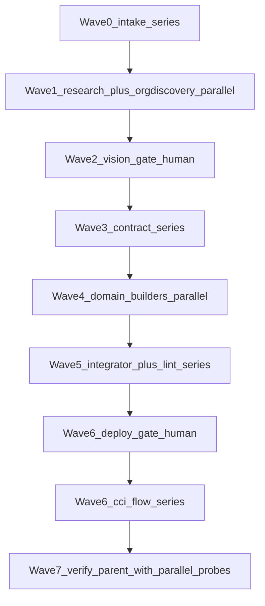

# Conductor reference — waves, launch templates, optimization

## Wave map



## What may run in parallel

| Safe in parallel | Why |
|---|---|
| Researcher + Org Discovery | One reads the web, one reads the org. No shared writes. |
| All Wave 4 builders | Disjoint directory ownership, frozen contract input. |
| Wave 7 verification probes | Read-only SOQL and report parsing. |

| Must stay series | Why |
|---|---|
| Intake before research | Research needs the company input. |
| Vision confirm before any write | AGENTS.md rule 5 and 7. |
| Contract before builders | Builders would otherwise invent conflicting SKUs and PSMs. |
| Integrator + lint before deploy ask | Catches cross-file drift while it is still free to fix. |
| CCI flow steps | Load order encodes FK dependencies and activation ordering. |

Never run two `sf sfdmu run` jobs against one org concurrently.

## Launch template — domain builder

Send all applicable builders in a single message with multiple Task calls.

```
description: PCM builder
subagent_type: generalPurpose
prompt: |
  Read and follow .cursor/skills/rlm-customer-demo-pcm/SKILL.md before doing anything.

  Repo: /Users/<you>/.../rlm-base-dev
  Contract: datasets/sfdmu/customer-template/en-US/sku-contract.yaml
  Org facts: datasets/sfdmu/customer-template/en-US/org-context.json

  Task: author the PCM dataset for the customer in the contract.

  You may write ONLY within:
    datasets/sfdmu/customer-template/en-US/customer-template-pcm/**

  Hard rules:
  - Never edit the contract, customer-pricebook-entries.csv, or another builder's directory.
  - Never run cci, sf, or any deploy/import command. Authoring only.
  - Use only ProductSellingModel names and UnitOfMeasure codes present in org-context.json.
  - Do not change any export.json operation from Upsert to Insert + deleteOldData.
  - This org is shared with other customers' demo data. Every name or code you author must
    carry the customer prefix, and must not appear in existingNames in org-context.json —
    these objects Upsert on name, so a collision overwrites a live record instead of
    creating one. Never delete, activate, or modify a record you did not author.

  Return: files written, any contract value you could not satisfy, and any org fact
  that was missing from org-context.json.
```

Swap the skill path, directory glob, and task line per builder. Keep the hard rules verbatim
in every launch — subagents have no other source for them.

State the prior state explicitly when it matters. Builders repeatedly reported "the directory
was already header-only, so this was a fill-in rather than a replace"; if you expect them to
replace a previous customer's rows, say so, and name the customer whose data is there.

Two builders also own a slice of Apex outside their dataset directory. Widen their write glob
accordingly, or they will correctly refuse to touch it:

| Builder | Extra path |
|---|---|
| Billing | `scripts/apex/activateCustomerDemoBilling.apex` |
| Usage-Rates | `scripts/apex/activateCustomerDemoRatingRecords.apex` |

## Launch template — org discovery

```
description: Org discovery
subagent_type: explore
prompt: |
  Run read-only SOQL against org alias <alias> and write a snapshot to
  datasets/sfdmu/customer-template/en-US/org-context.json.

  Use the sf username, not the CCI org name — sf data query --target-org does not resolve
  CCI aliases.

  Reference data: ProductSellingModel (Name + SellingModelType), ProrationPolicy (Name),
  UsageGrantRenewalPolicy (Code), UsageGrantRolloverPolicy (Code), UsageOveragePolicy
  (Name), UsageResourceBillingPolicy (Code + Name), FulfillmentStepDefinitionGroup
  (Id + Name), and whether Product2 records QB-DRO-BILL and QB-DRO-PROJ exist.

  Units of measure MUST include their class — a unit belongs to exactly one class and
  cannot be moved:
    SELECT UnitCode, Name, UnitOfMeasureClass.Code FROM UnitOfMeasure
    SELECT Code, Name FROM UnitOfMeasureClass
  Record as unitsOfMeasure[].ClassCode.

  Existing names, recorded under an "existingNames" object. Everything here Upserts on
  name or code, so the contract must not reuse any of them:
    PaymentTerm.Name, BillingPolicy.Name, BillingTreatment.Name, LegalEntity.Name,
    ProductCatalog (Name + Code), ProductClassification.Code,
    AttributeDefinition.DeveloperName, AttributePicklistValue.Code

  Occupied SKU prefixes: query Product2.StockKeepingUnit and record every distinct
  leading token as "occupiedSkuPrefixes". Also report how many foreign demo SKUs exist,
  so the conductor can decide org.load_mode.

  Read-only. Do not insert, update, delete, or deploy anything.
  This snapshot must describe the org BEFORE this customer is loaded — existingNames and
  occupiedSkuPrefixes exist to catch collisions with OTHER customers' records. Never
  refresh it after a load; if you must, exclude the customer's own prefix and namespace.
  If the org alias is unreachable, write an empty snapshot with a "reachable": false
  key and report that.
```

## Model routing

| Agent | Model |
|---|---|
| Conductor, Integrator | inherit |
| Researcher, Org Discovery | inherit (`explore` type is already fast) |
| PCM, Billing, Pricing, Usage-Rates, DRO | inherit — these are fragile CSV/Apex shapes |

Do not downgrade the CSV builders. The failure modes (silent SFDMU drops, cascade parent
failures) are exactly what a weaker model misses.

## Optimization levers

1. **Context isolation.** `AGENTS.md` holds only the conductor contract. Domain pitfalls
   live in skills plus file-scoped rules in `.cursor/rules/`, so a builder editing
   `LegalEntity.csv` loads billing pitfalls and nothing about rate cards.
2. **One org snapshot.** Wave 1 queries the org once; six builders read the JSON.
3. **Conditional fan-out.** Skip Usage-Rates, DRO, and Experience when their flags are false.
4. **Artifact-based resume.** A builder whose dataset already matches the contract is skipped.
5. **Gate hooks.** `.cursor/hooks.json` blocks `cci` / `sf sfdmu` / `sf project deploy` until
   `.cursor/onboarding-gates.json` records both gates.
6. **Parallel verification only.** Speed comes from authoring and reading concurrently, never
   from concurrent org mutations.

## Failure handling

| Symptom | Action |
|---|---|
| Builder reports a missing org fact | Re-run Org Discovery for that object; do not guess the value |
| Integrator reports drift | Re-launch the owning builder with the specific mismatch in the prompt |
| `validate_sfdmu_v5_datasets.py` fails | Fix in the owning dataset; never convert Upsert to Insert + deleteOldData to silence it |
| Two builders want the same file | Contract bug — the value belongs in `sku-contract.yaml`, not in two datasets |
