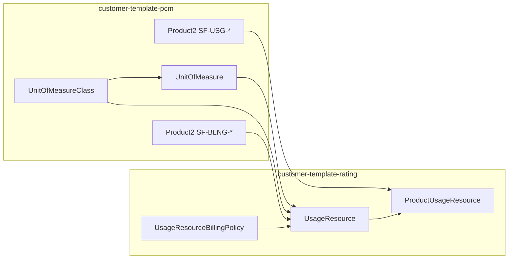

# UsageResource model — customer template (RLM rating)

This reference explains how **`UsageResource`** records tie together **unit of measure**, **usage-definition product**, **billing aggregation**, and **sellable usage products** (via **`ProductUsageResource`**), and how the repo’s **customer-template-rating** plan models them. Use it when extending a customer demo or debugging rating/quote behavior.

## What a UsageResource is

`UsageResource` is the **meter definition**: *what* is measured (UOM + class), *which product row* carries the usage-definition semantics, and *how usage rolls up for billing* (via **`UsageResourceBillingPolicy`**). The **RLM Usage Resource** layout (`templates/layouts/billing/UsageResource-RLM Usage Resource Layout.layout-meta.xml`) groups the main bindings:

| Area | Fields | Purpose |
|------|--------|--------|
| Identity | `Name`, `Code`, **`Category`**, `Status` | **`Category` must be `Usage`** for standard consumption meters (not `Token` / `Currency` unless modeling those patterns). |
| Units | **`UnitOfMeasureClassId`**, **`DefaultUnitOfMeasureId`** | Class defines the family of units; **default UOM must be a unit that belongs to that class** (same `UnitOfMeasureClass`). Example: class `DATAVOL` with default **TB** for storage; **GB** for transfer. |
| Definition | **`UsageDefinitionProductId`** | Lookup to **`Product2`** (the **usage-definition** SKU — not the customer-facing Pack product). Rating uses this link to connect the meter to catalog/product master data. |
| Aggregation | **`UsageResourceBillingPolicyId`** | Defines **`UsageAccumulationMethod`** (e.g. **Sum** vs **Peak**) and **`UsageAccumulationPeriod`** (e.g. **Monthly**). |

After insert, **`activate_rating_records`** (and customer-template pass 2) typically move **`UsageResource`** from **Draft** to **Active**.

## ProductUsageResource — how the meter attaches to the sellable SKU

**`ProductUsageResource`** (**PUR**) is the **junction** between a **sellable `Product2`** (the SKU you put on quotes — e.g. Pack **`SF-USG-STORAGE`**) and a **`UsageResource`** (the meter — e.g. **`SF-UR-STORAGE`**). The platform uses PUR to know **which consumption meters apply** when that product is sold; **`UsageResource`** alone does not attach a meter to a product.

| Concept | Role |
|--------|------|
| **`UsageResource`** | Defines the meter (UOM class, default UOM, usage-definition product, billing aggregation). |
| **`ProductUsageResource`** | Binds **that meter to a specific sellable SKU** so rating, rate cards, and quote/usage flows can resolve **product → meter**. |

**Fields you typically set in CSV** (see `customer-template-rating/ProductUsageResource.csv`):

- **`Product.StockKeepingUnit`** — **Pack / merchandised** product (`SF-USG-*`), **not** **`SF-BLNG-*`** (usage-definition products are linked from **`UsageResource.UsageDefinitionProduct`**, not from PUR).
- **`UsageResource.Code`** — must match a **`UsageResource`** row in the same load (e.g. `SF-UR-STORAGE`).
- **`Status`** — template uses **`Draft`** on insert; **`activate_rating_records`** activates PURs after **`UsageResource`** is Active (same Apex as QuantumBit; see `scripts/apex/activateRatingRecords.apex`).
- **`IsOptional`** — `false` when the meter is required for that product.
- **`TokenResource.Code`** — blank for non-token usage meters (Snowflake template).
- **`EffectiveStartDate` / `EffectiveEndDate`** — entitlement window; template uses a fixed start and open end.

**One sellable product, multiple meters:** In **`qb-rating`**, **`QB-DB`** has **two** PUR rows (e.g. **`UR-DATASTORAGE`** and **`UR-CPUTIME`**). The Snowflake customer template uses **one PUR per Pack** (`SF-USG-STORAGE` → `SF-UR-STORAGE`, etc.) for a straight 1:1 demo.

**UI:** The product record experience includes a **`ProductUsageResources`** related list (`RLM_Product_Record_Page`) so admins can see **which UsageResources** are tied to the SKU.

**Downstream:** **`RateCardEntry`** in **`customer-template-rates`** prices in the context of **sellable product × UsageResource** (and UOM), which assumes PURs exist and are activatable. **`ProductUsageResourcePolicy`** (child of PUR) refines policy per PUR; the **tier-1** customer plan does **not** load PURP — add **`qb-rating`-style** data if guided selling or line-level policy requires it.

**SFDMU:** `externalId` is **`Product.StockKeepingUnit;UsageResource.Code`** with a matching **`$$Product.StockKeepingUnit$UsageResource.Code`** column. This plan uses **`operation: Insert`** for PUR — run **`delete_customer_demo_rating_data`** before each reload to avoid duplicate Draft PURs. QuantumBit **`qb-rating`** uses **`Insert` + `deleteOldData: true`** instead for a full replace pattern (see `datasets/sfdmu/qb/en-US/qb-rating/README.md`).

## How it stitches to the rest of the template

1. **`UnitOfMeasureClass` + `UnitOfMeasure`** (PCM) — must exist **before** `UsageResource`. Each **`UsageResource.UnitOfMeasureClass`** must match the class of **`DefaultUnitOfMeasure`**.  
2. **`Product2` usage-definition rows** (`SF-BLNG-*`) — loaded in PCM; **`UsageResource.UsageDefinitionProduct`** points at them.  
3. **`UsageResourceBillingPolicy`** — define or reuse org-standard policies (see below).  
4. **`UsageResource`** — one row per meter (`Category = Usage`, codes e.g. `SF-UR-*`).  
5. **`Product2` sellable Pack rows** (`SF-USG-*`) — `UsageModelType` set in rating pass; **`ProductUsageResource`** is the **explicit link** from each Pack SKU to its **`UsageResource`** (see **ProductUsageResource** section above).  
6. **`RateCardEntry`** (rates plan) — prices **sellable product × UsageResource × UOM** (often **currency per default UOM**); entries assume PUR rows exist for that product + UR pair. **Base** cards set **`Rate`**, **`RateUnitOfMeasure`**, and **`RateNegotiation`** on the entry; **Tier** cards usually add **`RateAdjustmentByTier`**. See **`docs/references/customer-template-rate-card-entry.md`**.

## UsageResourceBillingPolicy: reuse vs customer-specific

| Code (QB / common) | Method | Period | Typical use |
|--------------------|--------|--------|-------------|
| **`monthlytotal`** | Sum | Monthly | Egress, compute, many “bill total volume” meters. |
| **`monthlypeak`** | Peak | Monthly | Storage-style “high watermark” / peak in period. |

**Customer template** uses these **standard codes** (Upsert in `customer-template-rating` so they match orgs seeded like QuantumBit). Avoid duplicating the same method/period under a one-off code unless you need a **scoped delete** in Apex (custom codes require custom cleanup).

**Previously:** a demo-only `SF-DEMO-STORAGE-PEAK` duplicated **Peak/Monthly**. Prefer **`monthlypeak`** unless you must isolate deletes from shared org data.

## “Usage resource component” in the UI

- **Record experience:** **`RLM_Usage_Resource_Record_Page`** (`templates/flexipages/standalone/billing/`) is the **UsageResource** flexipage.  
- **Related policies:** The layout includes a **`UsageResourcePolicy`** related list (overage, rating frequency, aggregation at UR level). The **tier-1 customer demo** does **not** load **`UsageResourcePolicy`** or **`ProductUsageResourcePolicy`**; full QuantumBit **`qb-rating`** does load **`ProductUsageResourcePolicy`** (per-**PUR** aggregation/frequency/overage). If guided selling or admin UIs expect those children, add a **phase-2** plan or document the gap.  
- **Upload / testing:** Utilities such as **`rlmUsageUploader`** resolve **UsageResource** and optional **UOM** options from live org data.

## Customer-template CSV checklist (`customer-template-rating`)

**`UsageResource.csv`**

- **`Category`** → **`Usage`**.  
- **`Code`** → stable external id (e.g. `SF-UR-STORAGE`).  
- **`DefaultUnitOfMeasure.UnitCode`** → must exist under **`UnitOfMeasureClass.Code`** (PCM).  
- **`UnitOfMeasureClass.Code`** → e.g. `DATAVOL`, `SNFCRED`.  
- **`UsageDefinitionProduct.StockKeepingUnit`** → e.g. `SF-BLNG-STORAGE` (not the Pack SKU).  
- **`UsageResourceBillingPolicy.Code`** → e.g. **`monthlypeak`** (storage) or **`monthlytotal`** (egress/compute).  
- **`TokenResource.Code`** → leave blank for non-token meters.

**`UsageResourceBillingPolicy.csv`**

- Seed **`monthlypeak`** and **`monthlytotal`** (Upsert) so scratch and trail orgs align with **`qb-rating`** naming.

**`ProductUsageResource.csv`**

- **`$$Product.StockKeepingUnit$UsageResource.Code`** — composite key matching **`externalId`** (`Product.StockKeepingUnit;UsageResource.Code`).
- **`Product.StockKeepingUnit`** — sellable Pack (**`SF-USG-*`**), not billing-definition SKUs.
- **`UsageResource.Code`** — meter code (**`SF-UR-*`**) that exists in **`UsageResource.csv`**.
- **`Status`** — **`Draft`** until **`activate_rating_records`** runs.
- **`IsOptional`**, **`TokenResource.Code`**, **effective dates** — as in the **ProductUsageResource** section above.

## Validation

- Query org: `UsageResource` where `Code` starts with customer prefix; confirm **`Category`**, **`DefaultUnitOfMeasure`**, **`UnitOfMeasureClass`**, **`UsageDefinitionProduct`**, **`UsageResourceBillingPolicy`**.  
- Open **Usage Resource** record in app — Details + **UsageDefinitionAndPolicies** section should be populated.  
- If **Related** policy lists are empty, tier-1 demo is still valid; add **ProductUsageResourcePolicy** / **UsageResourcePolicy** when the product team requires them.

## See also

- `datasets/sfdmu/customer-template/en-US/customer-template-rating/README.md`  
- `docs/references/customer-template-rate-card-entry.md` — **RateCardEntry** (base vs tiered, effective dates)  
- `datasets/sfdmu/qb/en-US/qb-rating/` (full rating shape)  
- `docs/guides/customer-demo-onboarding.md`  
- `AGENTS.md` → Customer Demo Product Onboarding UX  
