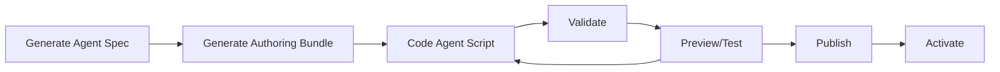
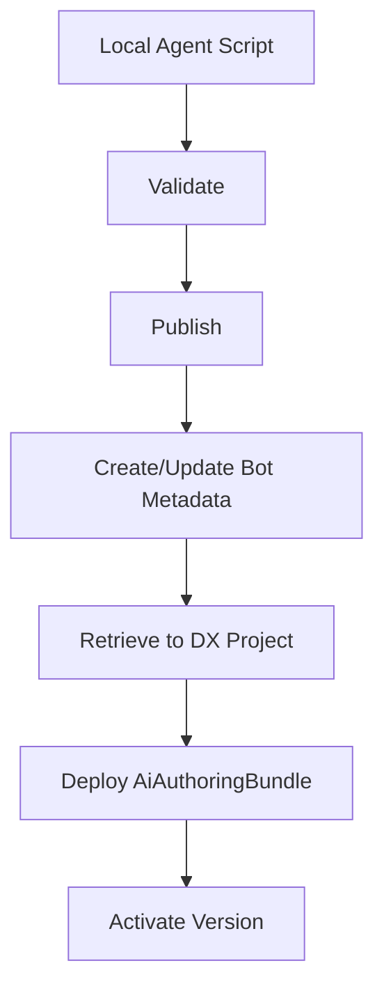

# Salesforce Agent Development with sf CLI

This document provides a comprehensive guide to developing and managing Salesforce Agentforce agents using the `sf agent` command suite. Use this as a reference for AI-assisted agent development workflows.

## Table of Contents
1. [Agent Development Workflow Overview](#agent-development-workflow-overview)
2. [Command Reference](#command-reference)
3. [Common Workflows](#common-workflows)
4. [Agent Script Development](#agent-script-development)
5. [Testing and Validation](#testing-and-validation)
6. [Deployment and Activation](#deployment-and-activation)
7. [Troubleshooting](#troubleshooting)

---

## Agent Development Workflow Overview

There are two primary approaches to developing Agentforce agents:

### Approach 1: Agent Script-Based (Recommended)
This is the modern, code-first approach using Agent Script language:



**Key Benefits:**
- Version controlled Agent Script files
- Local development and preview
- CI/CD friendly
- Supports simulated (mocked) and live action modes

### Approach 2: Declarative (Legacy)
Uses agent spec YAML files to create agents directly in the org (not recommended for most use cases).

---

## Command Reference

### Core Commands

#### `sf agent create`
Create an agent in your org using a local agent spec YAML file. **Note:** This creates agents without Agent Script; not recommended for modern development.

```bash
# Create with prompts
sf agent create --target-org my-org

# Create with specific name and spec
sf agent create --name "Resort Manager" --api-name Resort_Manager \
  --spec specs/resortManagerAgent.yaml --target-org my-org

# Preview without saving
sf agent create --name "Resort Manager" --spec specs/resortManagerAgent.yaml --preview
```

---

### Generate Commands

#### `sf agent generate agent-spec`
Generate an agent spec YAML file (high-level description).

**Use Case:** Starting point for creating new agents or generating authoring bundles.

#### `sf agent generate authoring-bundle`
Generate an authoring bundle (Agent Script blueprint) from an agent spec or from scratch.

```bash
# Generate with prompts
sf agent generate authoring-bundle --target-org my-org

# Generate from agent spec
sf agent generate authoring-bundle \
  --spec specs/agentSpec.yaml \
  --name "My Agent" \
  --target-org my-org

# Generate without spec (boilerplate only)
sf agent generate authoring-bundle \
  --no-spec \
  --name "My Agent" \
  --target-org my-org

# Generate to specific directory
sf agent generate authoring-bundle \
  --spec specs/agentSpec.yaml \
  --name "My Agent" \
  --output-dir other-package-dir/main/default \
  --target-org my-org
```

**Output Location:** `force-app/main/default/aiAuthoringBundles/<bundle-api-name>/`
- `<bundle-api-name>.bundle-meta.xml` - Metadata file
- `<bundle-api-name>.agent` - Agent Script file

**Important:** Requires an org connection because it uses an LLM to generate the Agent Script.

#### `sf agent generate test-spec`
Generate a test spec YAML file for testing an agent.

**Use Case:** Creating structured test cases for agent validation.

#### `sf agent generate template`
Generate an agent template from an existing agent for packaging in managed packages.

---

### Validate Commands

#### `sf agent validate authoring-bundle`
Validate that an Agent Script file compiles without errors.

```bash
# Validate with prompts
sf agent validate authoring-bundle --target-org my-org

# Validate specific bundle
sf agent validate authoring-bundle \
  --api-name MyAuthoringBundle \
  --target-org my-org
```

**Use Case:** Run this frequently while coding Agent Script files to catch syntax errors early.

**Output:** Lists syntax errors with descriptions and line numbers if validation fails.

---

### Publish Commands

#### `sf agent publish authoring-bundle`
Publish an authoring bundle to create a new agent or new version of existing agent.

```bash
# Publish with prompts
sf agent publish authoring-bundle --target-org my-org

# Publish specific bundle
sf agent publish authoring-bundle \
  --api-name MyAuthoringBundle \
  --target-org my-org

# Publish without retrieving metadata back
sf agent publish authoring-bundle \
  --api-name MyAuthoringBundle \
  --skip-retrieve \
  --target-org my-org
```

**What Happens:**
1. Validates Agent Script file compiles
2. Publishes Agent Script to org
3. Creates/updates Bot, BotVersion, GenAiX metadata
4. Retrieves metadata back to DX project (unless --skip-retrieve)
5. Deploys AiAuthoringBundle metadata to org

**Important:** Agent must be deactivated before publishing new versions.

---

### Preview Commands

#### `sf agent preview` (Interactive)
Have a natural language conversation with an agent for manual testing.

```bash
# Preview with selection list
sf agent preview --target-org my-org

# Preview authoring bundle in simulated mode (mocked actions)
sf agent preview --authoring-bundle My_Agent_Bundle --target-org my-org

# Preview authoring bundle in live mode (real actions)
sf agent preview --authoring-bundle My_Agent_Bundle \
  --use-live-actions \
  --target-org my-org

# Preview published agent with Apex debugging
sf agent preview --api-name My_Published_Agent \
  --use-live-actions \
  --apex-debug \
  --target-org my-org

# Save conversation transcripts to custom directory
sf agent preview --api-name My_Agent \
  --output-dir ./transcripts/my-preview \
  --target-org my-org
```

**Preview Modes:**
- **Simulated (default for Agent Script):** Mocks all actions using LLM based on Agent Script
- **Live:** Uses actual Apex classes, flows, and prompt templates in org

**Apex Debugging:** Use `--apex-debug` with live mode to enable Apex Replay Debugger.

**Output:** Saves API responses and chat transcripts to `./temp/agent-preview` (or custom directory).

#### `sf agent preview start` (Programmatic - Beta)
Start a programmatic preview session for automated testing.

```bash
# Start session with authoring bundle (mocked actions)
sf agent preview start --authoring-bundle My_Agent_Bundle --target-org my-org

# Start session with authoring bundle (live actions)
sf agent preview start --authoring-bundle My_Agent_Bundle \
  --use-live-actions \
  --target-org my-org

# Start session with published agent
sf agent preview start --api-name My_Published_Agent --target-org my-org
```

**Output:** Returns a session ID for use with `sf agent preview send`.

#### `sf agent preview send` (Programmatic - Beta)
Send a message to an existing preview session.

```bash
# Send message with session ID
sf agent preview send \
  --utterance "What can you help me with?" \
  --api-name My_Published_Agent \
  --session-id <SESSION_ID> \
  --target-org my-org

# Send message without session ID (works if only one active session)
sf agent preview send \
  --utterance "What can you help me with?" \
  --api-name My_Published_Agent \
  --target-org my-org

# Send message to authoring bundle
sf agent preview send \
  --utterance "what can you help me with?" \
  --authoring-bundle My_Local_Agent \
  --target-org my-org
```

#### `sf agent preview sessions`
List all active programmatic preview sessions.

#### `sf agent preview end`
End a programmatic preview session and get trace location.

---

### Test Commands

#### `sf agent test create`
Create an agent test in your org using a test spec YAML file.

#### `sf agent test list`
List available agent tests in your org.

#### `sf agent test run`
Start an agent test in your org.

```bash
# Start test without waiting
sf agent test run --api-name Resort_Manager_Test --target-org my-org

# Start test and wait 10 minutes for completion
sf agent test run --api-name Resort_Manager_Test \
  --wait 10 \
  --target-org my-org

# Run test and save JSON results to directory
sf agent test run --api-name Resort_Manager_Test \
  --wait 10 \
  --output-dir ./test-results \
  --result-format json \
  --target-org my-org

# Run test with verbose output (includes generated data)
sf agent test run --api-name Resort_Manager_Test \
  --wait 10 \
  --verbose \
  --target-org my-org
```

**Result Formats:**
- `human` (default): Human-readable tables
- `json`: JSON format
- `junit`: JUnit XML format
- `tap`: TAP format

**Verbose Mode:** Includes detailed generated data (invoked actions, Salesforce objects touched, etc.) useful for debugging test failures and building JSONPath expressions for custom evaluations.

#### `sf agent test resume`
Resume a previously started test to view results.

#### `sf agent test results`
Get results of a completed test run.

---

### Activation Commands

#### `sf agent activate`
Activate an agent version to make it available to users.

```bash
# Activate with prompts
sf agent activate --target-org my-org

# Activate specific version
sf agent activate \
  --api-name Resort_Manager \
  --version 2 \
  --target-org my-org
```

**Important:** 
- Only one version can be active at a time
- Agent must be active to preview with `sf agent preview`
- Version number corresponds to "vX" in BotVersion metadata (e.g., v4.botVersion-meta.xml → --version 4)

#### `sf agent deactivate`
Deactivate an agent to make changes or prevent user access.

```bash
# Deactivate with prompts
sf agent deactivate --target-org my-org

# Deactivate specific agent
sf agent deactivate --api-name Resort_Manager --target-org my-org
```

**Important:** Must deactivate before:
- Publishing new versions
- Adding/removing topics or actions
- Making structural changes

---

## Common Workflows

### Workflow 1: Create New Agent with Agent Script

```bash
# 1. Generate agent spec (optional, provides starting point)
sf agent generate agent-spec --target-org my-org

# 2. Generate authoring bundle from spec
sf agent generate authoring-bundle \
  --spec specs/myAgentSpec.yaml \
  --name "My Agent" \
  --api-name My_Agent \
  --target-org my-org

# 3. Edit the Agent Script file
# Location: force-app/main/default/aiAuthoringBundles/My_Agent/My_Agent.agent

# 4. Validate Agent Script compiles
sf agent validate authoring-bundle \
  --api-name My_Agent \
  --target-org my-org

# 5. Preview interactively (simulated mode)
sf agent preview --authoring-bundle My_Agent --target-org my-org

# 6. Preview with live actions (after deploying Apex/Flows)
sf agent preview --authoring-bundle My_Agent \
  --use-live-actions \
  --target-org my-org

# 7. Publish to org
sf agent publish authoring-bundle \
  --api-name My_Agent \
  --target-org my-org

# 8. Activate the agent
sf agent activate \
  --api-name My_Agent \
  --version 1 \
  --target-org my-org
```

### Workflow 2: Update Existing Agent

```bash
# 1. Deactivate current version
sf agent deactivate --api-name My_Agent --target-org my-org

# 2. Edit Agent Script file locally
# Location: force-app/main/default/aiAuthoringBundles/My_Agent/My_Agent.agent

# 3. Validate changes compile
sf agent validate authoring-bundle --api-name My_Agent --target-org my-org

# 4. Preview changes
sf agent preview --authoring-bundle My_Agent \
  --use-live-actions \
  --target-org my-org

# 5. Publish new version
sf agent publish authoring-bundle --api-name My_Agent --target-org my-org

# 6. Activate new version
sf agent activate --api-name My_Agent --version 2 --target-org my-org
```

### Workflow 3: Test-Driven Development

```bash
# 1. Generate test spec
sf agent generate test-spec --target-org my-org

# 2. Create test in org
sf agent test create --spec specs/myTestSpec.yaml --target-org my-org

# 3. Run tests after each Agent Script change
sf agent test run --api-name My_Agent_Test \
  --wait 10 \
  --result-format json \
  --output-dir ./test-results \
  --target-org my-org

# 4. Review results
sf agent test results --target-org my-org
```

### Workflow 4: Programmatic Testing (CI/CD)

```bash
# 1. Start preview session
SESSION_ID=$(sf agent preview start \
  --authoring-bundle My_Agent \
  --use-live-actions \
  --target-org my-org \
  --json | jq -r '.result.sessionId')

# 2. Send test utterances
sf agent preview send \
  --utterance "create a quote for Global Media" \
  --authoring-bundle My_Agent \
  --session-id $SESSION_ID \
  --target-org my-org \
  --json

# 3. Validate responses (parse JSON output)

# 4. End session
sf agent preview end \
  --session-id $SESSION_ID \
  --authoring-bundle My_Agent \
  --target-org my-org
```

---

## Agent Script Development

### File Structure

Authoring bundles are stored in:
```
force-app/main/default/aiAuthoringBundles/<bundle-api-name>/
├── <bundle-api-name>.bundle-meta.xml  # Metadata file
└── <bundle-api-name>.agent            # Agent Script file
```

### Key Concepts

**Agent Script Language:**
- Domain-specific language (DSL) for defining agent behavior
- Describes topics (what the agent can help with)
- Defines actions (Apex classes, Flows, Prompt Templates)
- Specifies instructions and conversation flows

**Topics:**
- Range of jobs the agent can handle
- Generated from agent spec or defined manually
- Each topic can have associated actions

**Actions:**
- Invocable Apex methods (@InvocableMethod)
- Flows with Start element
- Prompt Templates
- Can be mocked (simulated) or live (real implementations)

### Development Tips

1. **Start with Agent Spec:** Use `sf agent generate agent-spec` to capture high-level requirements
2. **Validate Frequently:** Run `sf agent validate authoring-bundle` after changes
3. **Preview in Simulated Mode First:** Test logic before implementing real actions
4. **Use Live Mode for Integration Testing:** Test with actual Apex/Flows after deployment
5. **Enable Apex Debug Logs:** Use `--apex-debug` when debugging action implementations
6. **Version Control Everything:** Commit Agent Script files, specs, and test specs to Git

---

## Testing and Validation

### Validation Levels

1. **Syntax Validation:** `sf agent validate authoring-bundle`
   - Checks Agent Script compiles
   - Fast feedback during development

2. **Interactive Preview:** `sf agent preview`
   - Manual conversational testing
   - Validates end-to-end flow
   - Saves transcripts for review

3. **Programmatic Preview:** `sf agent preview start/send/end`
   - Automated testing in CI/CD
   - Scriptable utterances
   - JSON output for assertions

4. **Structured Tests:** `sf agent test run`
   - Test spec-based validation
   - Multiple test cases per run
   - Formatted results (human, JSON, JUnit, TAP)

### Best Practices

**During Development:**
- Validate Agent Script after each change
- Preview in simulated mode to test topic selection logic
- Preview in live mode to test action implementations
- Use `--apex-debug` when actions behave unexpectedly

**Before Publishing:**
- Run full test suite with `sf agent test run`
- Test edge cases and error scenarios
- Verify all topics are reachable
- Confirm actions handle expected inputs

**In CI/CD:**
- Use programmatic preview sessions for automated testing
- Parse JSON output to validate responses
- Run structured tests with `--result-format junit` for CI integration
- Block merges if tests fail

---

## Deployment and Activation

### Metadata Components

Publishing an authoring bundle creates/updates:
- **Bot** - Agent definition
- **BotVersion** - Specific version (v1, v2, etc.)
- **GenAiX** - AI-related configurations
- **AiAuthoringBundle** - Agent Script blueprint

### Deployment Flow



### Activation Strategy

**Single Environment (Dev):**
- Deactivate → Edit → Validate → Publish → Activate

**Multiple Environments (Dev → QA → Prod):**
1. Develop and test in Dev org
2. Commit Agent Script and metadata to Git
3. Deploy metadata to QA/Prod using standard deployment tools
4. Activate appropriate version in each environment

**Version Management:**
- Each publish creates a new BotVersion (v1, v2, v3, ...)
- Only one version can be active per org
- Users see the active version
- Can rollback by activating previous version

---

## Troubleshooting

### Common Issues

#### Agent Script Validation Fails
**Symptom:** `sf agent validate authoring-bundle` reports syntax errors

**Solutions:**
- Review error message and line number
- Check Agent Script syntax against documentation
- Ensure all referenced actions exist
- Verify topic definitions are complete

#### Cannot Publish: Agent is Active
**Symptom:** `sf agent publish authoring-bundle` fails with "Cannot update record as Agent is Active"

**Solution:**
```bash
# Deactivate first
sf agent deactivate --api-name My_Agent --target-org my-org

# Then publish
sf agent publish authoring-bundle --api-name My_Agent --target-org my-org
```

#### Preview Can't Find Agent
**Symptom:** `sf agent preview` doesn't list expected agent

**Solutions:**
- For authoring bundles: Verify bundle exists in `force-app/main/default/aiAuthoringBundles/`
- For published agents: Verify agent is published AND activated
- Check you're connected to correct org

#### Actions Not Working in Preview
**Symptom:** Actions fail or behave incorrectly in live mode

**Solutions:**
- Deploy latest Apex classes and Flows to org
- Use `--apex-debug` flag to capture debug logs
- Verify action parameters match Agent Script definitions
- Check Apex class has `@InvocableMethod` annotation
- Ensure Flow has Start element configured correctly

#### Test Results Show Failures
**Symptom:** `sf agent test run` reports test case failures

**Solutions:**
- Use `--verbose` flag to see detailed generated data
- Review expected vs actual values in test results
- Check if actions are executing correctly
- Verify topic selection is working as expected
- Update test spec if agent behavior changed intentionally

---

## Quick Reference

### Most Common Commands

```bash
# Validate Agent Script
sf agent validate authoring-bundle --api-name <name> --target-org <org>

# Preview interactively with live actions
sf agent preview --authoring-bundle <name> --use-live-actions --target-org <org>

# Publish new version
sf agent deactivate --api-name <name> --target-org <org>
sf agent publish authoring-bundle --api-name <name> --target-org <org>
sf agent activate --api-name <name> --version <num> --target-org <org>

# Run tests
sf agent test run --api-name <test-name> --wait 10 --target-org <org>
```

### Finding API Names

**Authoring Bundle API Name:**
- Directory name under `force-app/main/default/aiAuthoringBundles/`
- Example: `My_Agent` from path `aiAuthoringBundles/My_Agent/`

**Published Agent API Name:**
- Directory name under `force-app/main/default/bots/`
- Example: `Resort_Manager` from path `bots/Resort_Manager/`

**Version Number:**
- From filename in bot directory
- Example: `v4` from `v4.botVersion-meta.xml` → `--version 4`

---

## Additional Resources

- [Agent Script Language Reference](https://developer.salesforce.com/docs/einstein/genai/guide/agent-script-language.html)
- [Agentforce Developer Guide](https://developer.salesforce.com/docs/einstein/genai/guide/agentforce.html)
- [Author an Agent Tutorial](https://developer.salesforce.com/docs/einstein/genai/guide/agent-dx-nga-author-agent.html)
- [sf CLI Command Reference](https://developer.salesforce.com/docs/atlas.en-us.sfdx_cli_reference.meta/sfdx_cli_reference/)

---

## Changelog

- **2026-04-01**: Initial documentation based on sf CLI 2.x agent commands
