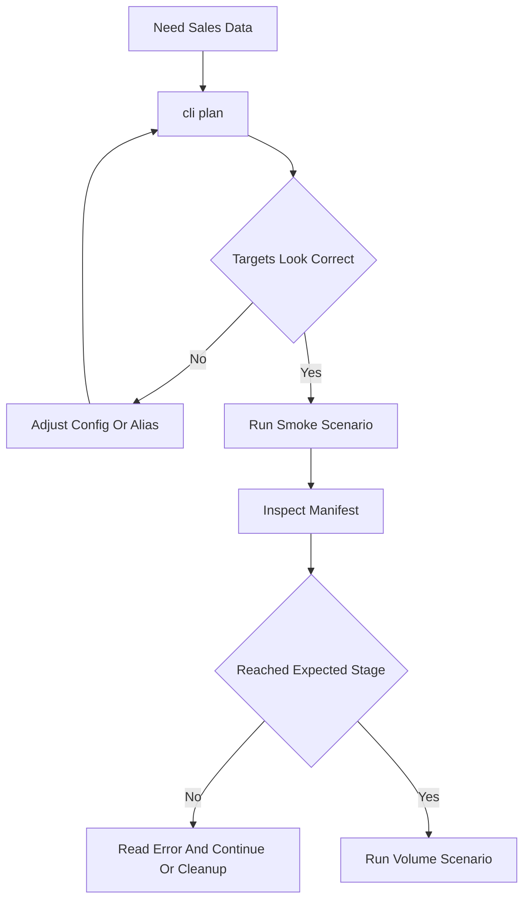

# AI Tools Guide — Transaction Data Harness

This file is the model-facing operating guide for creating and working with
Revenue Cloud transaction demo data. Prefer these commands over ad hoc API calls
unless you are changing the harness itself.

## Golden Rules

1. Always plan first with `--dry-run` / `cli plan`; do not write records until the
   account, product, stage caps, and target org look correct.
2. `--org` is an **sf CLI alias or username**, not a CCI alias. Example:
   `rlm-base__beta`, not `beta`.
3. Treat every run as additive. Re-running creates new records with a new run id.
4. Use manifest ids for verification and cleanup. Do not rely on
   `Order.Description` SOQL filters; that field is not filterable.
5. Do not claim a Posted invoice exists until the manifest has `reached_stage:
   "post"` and an org query confirms the invoice id/number or order link.
6. Posted invoices and BillingSchedules are platform-managed leftovers. Plan demo
   orgs accordingly; cleanup cannot fully restore a pre-run state.

## Tool Surface

### Plan Only

```bash
python -m scripts.txn_data_harness.cli plan --org <sf-alias> \
  --config scripts/txn_data_harness/scenarios/01-smoke-test.yaml
```

Use this before every write. It resolves auth, org discovery, account/product
targets, start-date ranges, stage caps, and concurrency without creating records.

### Run

```bash
python -m scripts.txn_data_harness.cli run --org <sf-alias> \
  --config scripts/txn_data_harness/scenarios/01-smoke-test.yaml \
  --concurrency 1 -v
```

Start with a smoke test before volume. Increase `--concurrency` gradually; higher
values are not broadly tested against API limits and async billing contention.

Transient failures (network blips, `UNABLE_TO_LOCK_ROW`, rate limits) are retried
automatically, resuming from the last checkpointed stage. Tune with
`--max-retries N` (default 2; `0` disables). Deterministic failures (e.g. a
missing field, a precondition like "quote_id is required before order") fail fast
and are never retried. After a batch, a report is written to
`out/<base_run_id>-report.json` (and `.md`) with success/failure counts, a
stage-reached histogram, and a failure-signature rollup.

### Inspect

```bash
python -m scripts.txn_data_harness.cli inspect --latest
python -m scripts.txn_data_harness.cli inspect --manifest scripts/txn_data_harness/out/<run_id>.json
python -m scripts.txn_data_harness.cli inspect --latest --json    # machine-readable
```

Use inspect after every run. It returns JSON with `run_id`, account, reached
stage, error, line count, created ids, invoice number, and `usage_journal_ids`.
Pass `--json` for scripted workflows (the `path` field can be piped into
`cli step --manifest`).

### Rate (usage orchestration — one-shot, ~15 min, org-wide)

```bash
python -m scripts.txn_data_harness.cli rate --org <sf-alias>
python -m scripts.txn_data_harness.cli rate --org <sf-alias> --flow-name <flow>
```

Invokes `RLM_UsageOrchestrationController.startOrchestration(...)` via
anonymous Apex to start `RLM_OrchestrateUsageManagement` (or another flow
via `--flow-name`). The job runs asynchronously, processes **every** usage
product in the org, and typically takes ~15 minutes. Fires and exits — no
polling. Run **once per batch** after `usage`-stage scenarios finish, then
monitor in Setup → Monitor Workflow Services and verify rated output by
SOQL (`TransactionJournal.Status` flips `Pending → Processed`, `UsageSummary`
rows appear).

### Continue To A Stage

```bash
python -m scripts.txn_data_harness.cli step --org <sf-alias> \
  --manifest scripts/txn_data_harness/out/<run_id>.json \
  --account Infinitech \
  --to-stage invoice
```

The step command runs the remaining lifecycle steps from the manifest's
`reached_stage` through `--to-stage`. It uses the shared step registry, so it
preserves the live-verified ordering rules.

### Report

```bash
python -m scripts.txn_data_harness.cli report <base_run_id>
python -m scripts.txn_data_harness.cli report <base_run_id> --markdown
```

Rebuilds the batch report from manifests already on disk (all `out/*.json` sharing
the `<base_run_id>` prefix). Use it to re-summarize an older batch or to read a
failure-signature rollup when triaging which scenarios to continue or clean up.

### Prune

```bash
python -m scripts.txn_data_harness.cli prune --older-than 7d        # dry run
python -m scripts.txn_data_harness.cli prune --older-than 7d --yes  # delete
```

Deletes manifest JSON in `out/` older than the retention window (`7d` / `24h` /
`30m`). Defaults to a dry run; pass `--yes` to delete. Only the harness's own
`out/` directory can be pruned.

## Decision Flow



## Verification Queries

Use ids from the manifest:

```bash
sf data query --target-org <sf-alias> -q "
  SELECT Id, OrderNumber, Status FROM Order WHERE Id = '<orderId>'"

sf data query --target-org <sf-alias> -q "
  SELECT Id, InvoiceNumber, Status, TotalAmount, Description
  FROM Invoice WHERE Id = '<invoiceId>'"
```

For Posted invoice linkage after `post`:

```bash
sf data query --target-org <sf-alias> -q "
  SELECT Id, InvoiceNumber, Status, TotalAmount
  FROM Invoice WHERE ReferenceEntityId = '<orderId>'"
```

## Stop Conditions

Stop and ask for guidance when:

- The plan caps a scenario unexpectedly, especially from `post` to `order`.
- A product fails PST placement; a clean PricebookEntry is not enough for bundles
  whose mandatory slots need user input, or other products needing unsupported
  configuration. **Default-configured bundles** (e.g. `QB-COMPLETE`) **do** place
  — PST expands the component graph from defaults.
- A run reaches `post` in the manifest but org verification cannot find the
  invoice by manifest id.
- Cleanup is requested for Posted invoices or BillingSchedules; explain that they
  are not cleanly deletable.

## Cleanup Reminder

Use `docs/guides/txn-data-harness.md` cleanup recipes. Delete what is deletable
from manifest ids: assets/orders, then quote, then opportunity. Revert activated
orders to Draft before deleting. Posted invoices and BillingSchedules remain.
