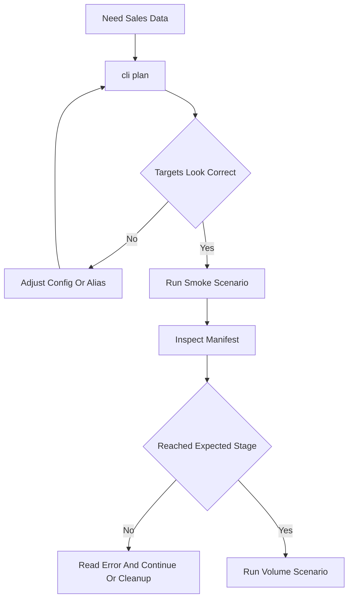

# AI Tools Guide — Transaction Data Harness

This file is the model-facing operating guide for creating and working with
Revenue Cloud transaction demo data. Prefer these commands over ad hoc API calls
unless you are changing the harness itself.

## Golden Rules

1. Always plan first with `--dry-run` / `cli plan`; do not write records until the
   account, product, stage caps, and target org look correct.
2. `--org` is an **sf CLI alias or username**, not a CCI-only alias.
3. Treat every run as additive. Re-running creates new records with a new run id.
4. Use manifest ids for verification and cleanup. Do not rely on
   `Order.Description` SOQL filters; that field is not filterable.
5. Do not claim a Posted invoice exists until the manifest has `reached_stage:
   "post"` and an org query confirms the invoice id/number or order link.
6. Posted invoices and BillingSchedules are platform-managed leftovers. Plan demo
   orgs accordingly; cleanup cannot fully restore a pre-run state.

## Tool Surface

### Plan Only

```bash
python -m scripts.txn_data_harness.cli plan --org <sf-alias> \
  --config scripts/txn_data_harness/scenarios/01-smoke-test.yaml
```

Use this before every write. It resolves auth, org discovery, account/product
targets, start-date ranges, stage caps, and concurrency without creating records.

### Run

```bash
python -m scripts.txn_data_harness.cli run --org <sf-alias> \
  --config scripts/txn_data_harness/scenarios/01-smoke-test.yaml \
  --concurrency 1 -v
```

Start with a smoke test before volume. Increase `--concurrency` gradually; higher
values are not broadly tested against API limits and async billing contention.

`--count N` does NOT shrink a `--config` whose scenarios pin `count:` (per-scenario
wins over CLI; see `scenarios/README.md` → Precedence). To smoke a multi-scenario
config, edit the per-scenario `count:` to 1 (or copy the scenario you want into a
temporary file) rather than relying on `--count`.

Transient failures (network blips, `UNABLE_TO_LOCK_ROW`, rate limits) are retried
automatically, resuming from the last checkpointed stage. Tune with
`--max-retries N` (default 2; `0` disables). Deterministic failures (e.g. a
missing field, a precondition like "quote_id is required before order") fail fast
and are never retried. After a batch, a report is written to
`out/<base_run_id>-report.json` (and `.md`) with success/failure counts, a
stage-reached histogram, and a failure-signature rollup.

Activation only checkpoints `reached_stage: "activate"` after BillingSchedule
polling and asset polling complete. Draft invoice ingestion retries only when a
transient failure happens before any invoice id is observed; once an invoice id
is known, the manifest records it and stops rather than replaying the ingest
graph.

### Inspect

```bash
python -m scripts.txn_data_harness.cli inspect --latest
python -m scripts.txn_data_harness.cli inspect --manifest scripts/txn_data_harness/out/<run_id>.json
python -m scripts.txn_data_harness.cli inspect --latest --json    # machine-readable
```

Use inspect after every run. The default output is human-readable. Pass `--json`
for scripted workflows; JSON includes `run_id`, account, reached stage, error,
line count, created ids, invoice number, warning fields, and a `path` field that
can be piped into `cli step --manifest`.

### Rate (usage orchestration — one-shot, ~15 min, org-wide)

```bash
python -m scripts.txn_data_harness.cli rate --org <sf-alias>
python -m scripts.txn_data_harness.cli rate --org <sf-alias> --flow-name <flow>
```

Invokes `RLM_UsageOrchestrationController.startOrchestration(...)` via
anonymous Apex to start `RLM_OrchestrateUsageManagement` (or another flow
via `--flow-name`). The job runs asynchronously, processes **every** usage
product in the org, and typically takes ~15 minutes. Fires and exits — no
polling. Run **once per batch** after `usage`-stage scenarios finish, then
monitor in Setup → Monitor Workflow Services and verify rated output by
SOQL (`TransactionJournal.Status` flips `Pending → Processed`, `UsageSummary`
rows appear).

### Continue To A Stage

```bash
python -m scripts.txn_data_harness.cli step --org <sf-alias> \
  --manifest scripts/txn_data_harness/out/<run_id>.json \
  --account "<billing-ready-account-name>" \
  --to-stage invoice
```

The step command runs the remaining lifecycle steps from the manifest's
`reached_stage` through `--to-stage`. It uses the shared step registry, so it
preserves the live-verified ordering rules.

### Report

```bash
python -m scripts.txn_data_harness.cli report <base_run_id>
python -m scripts.txn_data_harness.cli report <base_run_id> --markdown
```

Rebuilds the batch report from manifests already on disk (all `out/*.json` sharing
the `<base_run_id>` prefix). Use it to re-summarize an older batch or to read a
failure-signature rollup when triaging which scenarios to continue or clean up.

### Prune

```bash
python -m scripts.txn_data_harness.cli prune --older-than 7d        # dry run
python -m scripts.txn_data_harness.cli prune --older-than 7d --yes  # delete
```

Deletes manifest JSON in `out/` older than the retention window (`7d` / `24h` /
`30m`). Defaults to a dry run; pass `--yes` to delete. Only the harness's own
`out/` directory can be pruned.

### Recipes — subscription terms

```yaml
# Place a 3-year subscription on a TermDefined product.
scenarios:
  - account: "<billing-ready-account-name>"
    products:
      - sku: "<term-defined-sku>"
        term: {count: 3, unit: Annual}
```

```yaml
# Place a 4-quarter (1-year on a Quarterly SOM) subscription. The SKU MUST
# be bound to a PBE whose ProductSellingModel.PricingTermUnit = "Quarterly".
scenarios:
  - account: "<billing-ready-account-name>"
    products:
      - sku: "<quarterly-term-sku>"
        term: {count: 4, unit: Quarterly}
```

```yaml
# Bare-int form -- count only; unit follows the resolved PSM.
scenarios:
  - account: "<billing-ready-account-name>"
    products:
      - sku: "<term-defined-sku>"
        term: 24
```

Rules to keep in mind when authoring `term:`:

- `unit` is the `ProductSellingModel.PricingTermUnit` picklist: `Months`,
  `Quarterly`, `Semi-Annual`, `Annual`. `Years` is accepted as an alias for
  `Annual`. Anything else (e.g. `Days`) raises `ConfigError`.
- An explicit `unit` must equal the resolved PSM's `PricingTermUnit`; the
  harness will not implicitly switch PBEs. Pin `selling_model: "<PSM Name>"`
  on the product entry when a SKU has multiple PBEs.
- `term` is for **TermDefined** products only. The platform rejects `EndDate`
  (and the SubscriptionTerm fields) on Evergreen / OneTime lines, so the
  config layer raises before the call goes out.
- The harness writes `SubscriptionTerm` and `SubscriptionTermUnit` **only**;
  it never writes `EndDate`, `PricingTerm`, or `PricingTermCount`. The
  platform derives `EndDate` (inclusive `start + term - 1 day`) and
  recalculates the pricing-term fields from your inputs + the PBE. Verify a
  term by reading all of those back.

Full schema in `scenarios/README.md` → *Subscription terms*.

### Recipes — explicit `end_date` (co-term / off-cycle)

When the demo needs a **specific** `EndDate` (co-terming a multi-line
quote to one calendar anchor; landing on a fiscal-quarter boundary; an
off-cycle ramp), pin `end_date:` alongside `term:`. The platform honors
the explicit date and prorates `PricingTermCount` against the actual span
(~0.27% drift for a 366-day "1×Annual" line).

```yaml
# Scenario-level co-term: every TermDefined line on the quote anchors to
# 2027-01-14 regardless of individual cadences.
scenarios:
  - account: "<billing-ready-account-name>"
    term: {count: 1, unit: Annual}
    end_date: "2027-01-14"
    products:
      - sku: "<term-defined-sku>"
      - sku: "<another-term-defined-sku>"
```

```yaml
# Per-line relative offset. Supported units: d, mo, q, y.
scenarios:
  - account: "<billing-ready-account-name>"
    products:
      - sku: "<term-defined-sku>"
        term: 12
        end_date: "12mo"   # 12 calendar months from StartDate (day-clamp)
      - sku: "<quarterly-term-sku>"
        term: {count: 4, unit: Quarterly}
        end_date: "3q"     # 9 calendar months
```

Rules for `end_date:`:

- **Requires a `term:`**. The platform still needs `SubscriptionTerm` for
  billing-schedule derivation; `end_date` only overrides the anchor.
- **TermDefined only.** Evergreen / OneTime reject `EndDate`; the config
  layer raises before the call goes out.
- **Units:** `d` (days), `mo` (calendar months, day-clamped), `q` (= 3 mo),
  `y` (= 12 mo). Bare `m` is **rejected** (ambiguous between months /
  minutes / meters — spell it `mo`).
- **Forms:** absolute ISO date (`"2027-01-14"`), bare int = days (`364`),
  or `"<n><unit>"`.
- **Forward-only.** Zero / negative offsets reject. Range 1d–20y.
- **Line wins over scenario.** A line that pins its own `end_date:`
  overrides the scenario default for just that line.
- **`EndDate` wins pricing math.** `PricingTermCount` is computed from
  `(EndDate − StartDate) / 365` regardless of the `SubscriptionTerm`
  value. Keep `term:` and `end_date:` consistent or the readback will
  surprise you. (See `CONTRACTS.md` → *Probed edge cases*.)
- **One `BillingSchedule` per `OrderItem` at activation.** A
  multi-year deal is **not** fanned out into per-period rows at
  activation — it's a single row spanning the deal, with
  `BillingTerm = 1` / `BillingTermUnit` = PSM cadence and
  `TotalAmount` prorated against the actual `(EndDate − StartDate)`
  span (same 365-day math as `PricingTermCount`). Periodic
  invoicing advances `NextBillingDate` lazily as invoices post.
  Monthly-SOM short spans (28- and 30-day) over-bill the period
  amount — proration math TBD; treat as a known gap. See
  `CONTRACTS.md` → *BillingSchedule fan-out across `end_date`
  scenarios*.

Full schema in `scenarios/README.md` → *Explicit `EndDate` overrides*.

## Decision Flow



## Verification Queries

Use ids from the manifest:

```bash
sf data query --target-org <sf-alias> -q "
  SELECT Id, OrderNumber, Status FROM Order WHERE Id = '<orderId>'"

sf data query --target-org <sf-alias> -q "
  SELECT Id, InvoiceNumber, Status, TotalAmount, Description
  FROM Invoice WHERE Id = '<invoiceId>'"
```

For Posted invoice linkage after `post`:

```bash
sf data query --target-org <sf-alias> -q "
  SELECT Id, InvoiceNumber, Status, TotalAmount
  FROM Invoice WHERE ReferenceEntityId = '<orderId>'"
```

## Stop Conditions

Stop and ask for guidance when:

- The plan caps a scenario unexpectedly, especially from `post` to `order`.
- A product fails PST placement; a clean PricebookEntry is not enough for bundles
  whose mandatory slots need user input, or other products needing unsupported
  configuration. **Default-configured bundles** (example: `QB-COMPLETE` from
  the bundled QB demo dataset; any default-configured bundle works) **do** place
  — PST expands the component graph from defaults.
- A run reaches `post` in the manifest but org verification cannot find the
  invoice by manifest id.
- Cleanup is requested for Posted invoices or BillingSchedules; explain that they
  are not cleanly deletable.

## Cleanup Reminder

Use `docs/guides/txn-data-harness.md` cleanup recipes. Delete what is deletable
from manifest ids: assets/orders, then quote, then opportunity. Revert activated
orders to Draft before deleting. Posted invoices and BillingSchedules remain.
